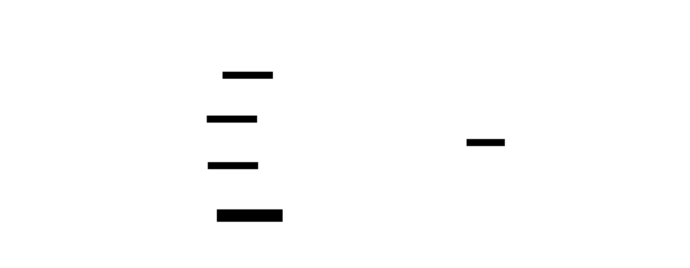
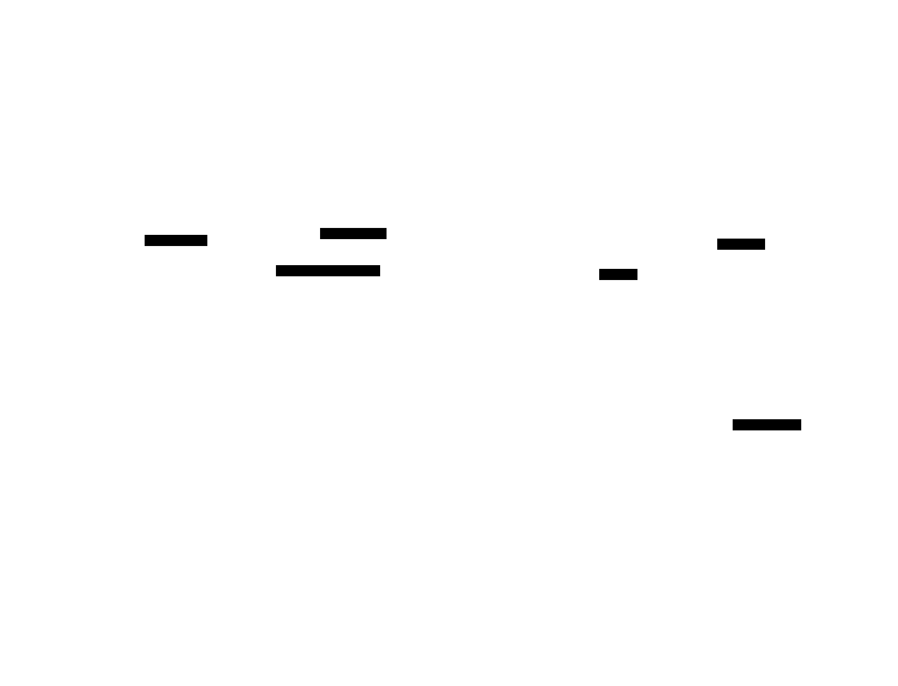

# Architecture — field-provider registry & cross-pack click coordination

This document describes the two API surfaces added in kit v0.4.0 and the single
mechanism underneath them. For the decision record and the options considered,
see [ADR-0001](../blueprint/adrs/0001-cross-pack-field-provider-and-click-coordination.md).
For a copy-paste onboarding guide, see [ONBOARDING.md](../ONBOARDING.md).

## The problem

The four usability packs each inline their own copy of this kit and each
intercept a widget's `onPointerDown` to open a touch modal. They don't compose:

- `comfyui-prompt-editor` (an all-fields node editor) renders a dumb
  `<input type=number>` for `seed` and a dumb `<select>` for `sampler_name` /
  `ckpt_name`, even when `comfyui-touch-numeric` / `-sampler-info` /
  `-model-gallery` are installed and each owns a richer control for exactly
  those widgets.
- Because the kit is inlined per pack, each pack had its own private
  `let ACTIVE` modal singleton — opening one pack's modal didn't dismiss
  another's (two backdrops, ambiguous ownership).
- The window-level gesture packs grab `window` pointerdown in capture phase
  with no coordination; an open modal can't veto a canvas gesture.

## The mechanism: a runtime rendezvous (`Symbol.for`)

All shared state lives on **one object** keyed by a well-known Symbol on
`globalThis` (`src/kit-global.ts`):

```ts
const KEY = Symbol.for("laurigates.comfyModalKit");
// getKit() → { fieldProviders, activeModal, pointerClaim }
```

A module-level `let` would be duplicated once per inlined pack copy — the exact
reason the packs don't coordinate today. `Symbol.for(key)` resolves to the
**same** symbol in every realm, so every inlined copy reads and writes the one
`KitRuntime` instance.

> **Version / compatibility.** The *shape* of the shared `KitRuntime` object is
> the cross-pack compatibility surface. Two packs bundling different kit
> versions share the same global slot, so the shape must only ever be extended
> **additively** — add fields, never re-shape or rename existing ones.

## Surface 1 — field-provider registry (`src/field-registry.ts`)

A **provider** pack registers an enhanced inline control; a **consumer** (the
editor) resolves the best match per field and mounts it.

```
FieldProvider  { id, priority?, match(widget, node), create(ctx) → FieldControl }
FieldControl   { el, getValue(), hasChanged(), focus?(), destroy?() }
```

| Function | Role |
|---|---|
| `registerFieldProvider(p)` | Provider side. Idempotent by `id` (re-register replaces in place). |
| `resolveFieldProvider(widget, node)` | Consumer side. Highest-priority match; ties → earliest registered; a throwing `match()` is swallowed and treated as no-match; **returns `null` when nothing matches**. |
| `getFieldProviders()` | The live provider list (diagnostics). |

**`FieldControl` maps 1:1 onto the editor's existing `FieldRow`**
(`el`/`read`/`changed`/`focus`), so the editor wraps a resolved control into a
row with no structural change and calls `destroy()` on close.

**Load order doesn't matter — resolution is lazy.** The editor calls
`resolveFieldProvider` when it *renders* a field, not at startup, so a provider
that registers after the editor loads is still picked up the next time the
editor opens.

### Dependency inversion

Providers and the consumer both depend on the kit's `FieldProvider` contract,
never on each other — no pack-to-pack dependency web.



### Field resolution sequence


### The additive-fallback guarantee

`resolveFieldProvider` returning `null` is the contract's load-bearing case: the
consumer MUST fall back to its built-in control. Installing zero, one, or all
sibling packs all work — unclaimed fields keep the built-in `<input>`/`<select>`
and nothing breaks.

## Surface 2 — modal + pointer coordination (`src/modal-coordinator.ts`)

| Function | Role |
|---|---|
| `setActiveModal(handle)` | Register the single active modal; dismisses any prior one (across packs) and installs the pointer guard. |
| `dismissActiveModal()` | Close the active modal. Clears the shared slot **before** calling `close()` so a re-entrant close can't recurse; idempotent; swallows a throwing `close()`. |
| `isModalActive()` / `getActiveModal()` | Query the shared slot. |
| `patchWidgetPointer(widget, opener)` | The uniform chain-original-then-consume `onPointerDown` wrapper, with native fallback on error. Returns a `restore()`. |
| `claimPointer(id)` | Pointer-claim protocol: a gesture pack records that it took a pointer (advisory). |
| `installPointerGuard()` | Best-effort capture-phase `window` guard (idempotent; no-op outside a browser). |

`modal-shell.ts` now routes its single-active discipline through the shared
`activeModal` slot instead of a module-local `let ACTIVE`, so any pack's
`openModalShell` dismisses whatever is truly on screen. Backdrop-pointerdown
dismiss, ESC, and focus-on-rAF are unchanged.

### Active-modal + pointer guard flow



### The veto is best-effort

While a modal is active, the window guard dismisses the modal and
`stopImmediatePropagation()`s a pointerdown that lands **outside** the modal, so
window-level gesture packs don't also act on that tap. But same-target
window-capture listener order across packs is non-deterministic, so a gesture
pack whose listener runs before the guard still fires. **Full** veto therefore
needs the gesture packs to consult `isModalActive()` themselves before acting —
that is the pointer-claim protocol, and gesture-pack adoption of it is deferred
(future work, tracked as an issue on this repo).

## Compatibility summary

- **Additive only.** Every new export is opt-in; no consumer must change.
- **Fallback preserved.** No provider ⇒ built-in control; no coordinator
  adoption ⇒ existing modal behavior.
- **Shared-shape stability.** The `KitRuntime` object is the compat surface —
  extend it additively across kit versions.
